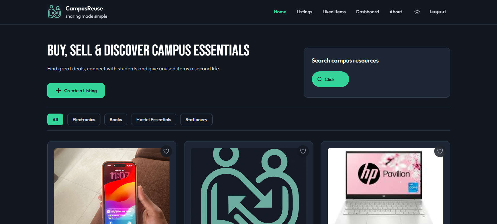
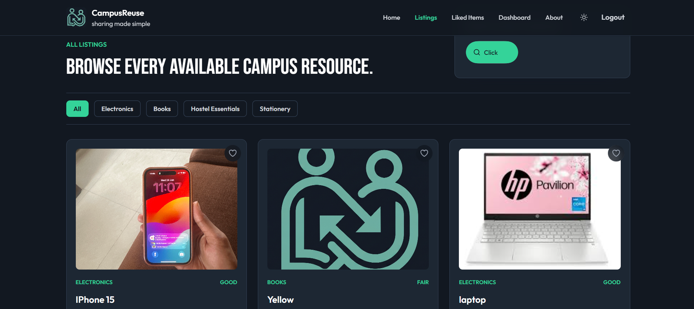
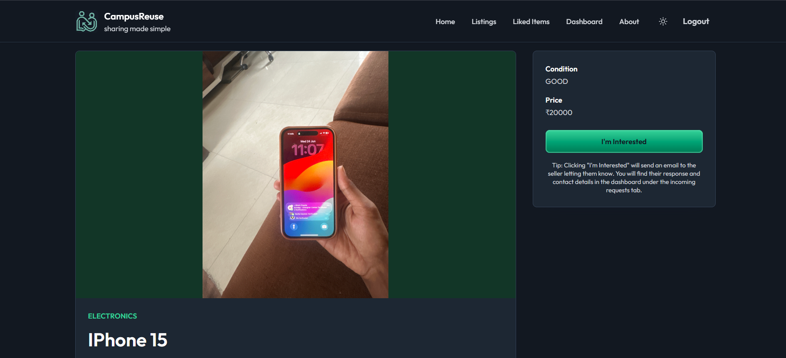
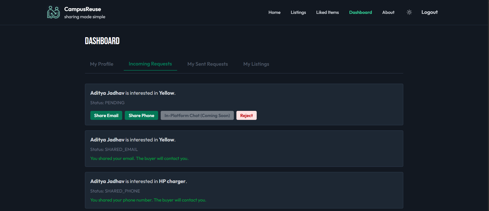
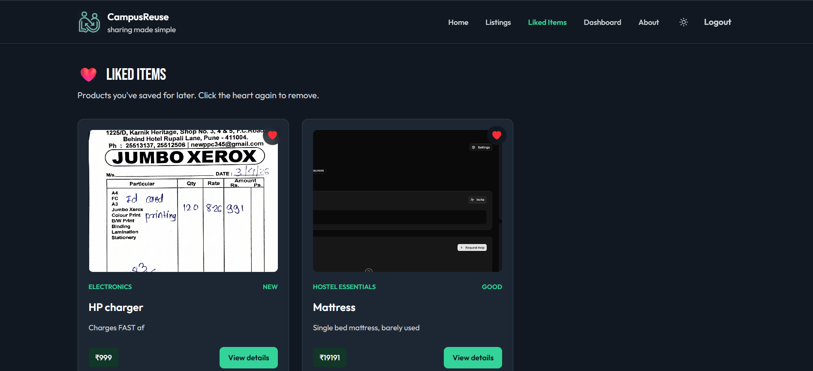
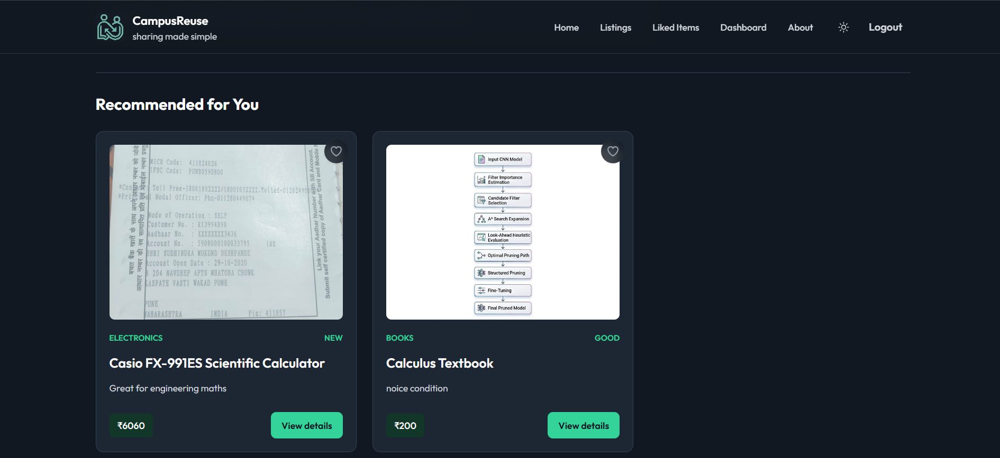

# CampusReuse ♻️

### AI-Powered Campus Marketplace for Students

🔗 **Live Demo:** https://campus-reuse.vercel.app

CampusReuse is a full-stack AI-powered marketplace designed specifically for college students to buy, sell, exchange, and discover second-hand products within their campus community. The platform combines secure authentication, intelligent product discovery, personalized recommendations, semantic search, cloud deployment, and modern DevOps practices to create a seamless student marketplace experience.

---

## 📸 Screenshots

### Home Page
<!-- Add screenshot here -->


### Product Listings
<!-- Add screenshot here -->


### Product Details
<!-- Add screenshot here -->


### Dashboard
<!-- Add screenshot here -->


### Liked Items
<!-- Add screenshot here -->


### Recommendation System
<!-- Add screenshot here -->


---

## 🎯 Motivation

Every semester, thousands of perfectly usable books, electronics, hostel essentials, and study materials remain unused while students spend money buying the same items new.

CampusReuse was built to create a sustainable campus ecosystem where students can discover, exchange, and reuse resources within their community while saving money and reducing waste.

---

# 🚀 Features

## 🔐 Authentication & Security

* Google OAuth 2.0 Login
* JWT-Based Authentication & Authorization
* Protected REST APIs
* Role-Based Access Control
* Secure Buyer-Seller Interactions
* Persistent User Sessions

---

## 🛍 Marketplace Functionality

* Create Product Listings
* Update and Manage Listings
* Product Categories & Filtering
* Product Search Functionality
* Product Availability Management
* Product Detail Pages
* Saved / Liked Items System
* Responsive Mobile-Friendly Interface

---

## 💬 Communication System

* Buyer-Seller Inquiry System
* Secure In-App Messaging
* Notification Management
* Seller Email Notifications
* Automated Inquiry Alerts

When a buyer expresses interest in a product, the seller automatically receives an email notification containing:

* Product Information
* Buyer Details
* Direct Link to the Inquiry

---

## 🤖 AI-Powered Features

### Recommendation Engine

CampusReuse tracks user interactions and product viewing history to generate personalized recommendations.

Features:

* View-Based Recommendations
* Personalized Product Suggestions
* Cosine Similarity Matching
* User Behavior Analysis

---

### Semantic Search

Traditional search requires exact keywords.

CampusReuse uses NLP-powered semantic search to understand meaning rather than exact words.

Examples:

| Search Query | Matching Product    |
| ------------ | ------------------- |
| power brick  | Laptop Charger      |
| study lamp   | Desk Light          |
| notebook     | Engineering Journal |

Powered by:

* Sentence Transformers
* FastAPI NLP Service
* Vector Similarity Search

---

## ⚡ Performance Optimization

### Redis Caching

To improve scalability and reduce database load:

* Frequently Accessed Products Cached
* Search Results Cached
* Recommendation Results Cached
* Faster API Responses
* Reduced PostgreSQL Queries

---

## ☁️ Cloud & DevOps

### Deployment Infrastructure

* Docker Containerization
* AWS EC2 Hosting
* AWS S3 Image Storage
* GitHub Actions CI/CD
* Caddy Reverse Proxy (Automatic HTTPS)
* Vercel Frontend Deployment

---

# 🛠 Tech Stack

## Frontend

* React.js
* TypeScript
* Vite
* Tailwind CSS
* Axios
* React Router

---

## Backend

* Spring Boot
* Spring Security
* Spring Data JPA
* Hibernate
* JWT Authentication

---

## Database & Caching

* PostgreSQL
* Redis

---

## AI & NLP

* Sentence Transformers
* Cosine Similarity
* Semantic Search
* Recommendation Engine

---

## Cloud & DevOps

* AWS EC2
* AWS S3
* Docker
* Caddy
* GitHub Actions
* Vercel

---

# 📊 Database Design

The application uses a normalized PostgreSQL schema with multiple relational entities:

### Core Entities

* User
* Product
* Category
* Inquiry
* ProductView
* Review
* SavedItem
* Notification

These entities support:

* Marketplace Operations
* Recommendation Generation
* Product Discovery
* User Engagement Tracking
* Notification Management

---

# 🏗 System Architecture

```text
Students
    │
    ▼
┌────────────────────┐
│  Vercel Frontend   │
│ React + TypeScript │
└──────────┬─────────┘
           │ REST APIs over HTTPS
           ▼
┌────────────────────┐
│ Spring Boot Backend│
│      AWS EC2       │
└───────┬─────┬──────┘
        │     │
        │     ├────────────► Redis Cache
        │
        ├────────────► PostgreSQL
        │
        ├────────────► AWS S3
        │
        ├────────────► Gmail SMTP
        │
        └────────────► NLP Service
                         (Semantic Search)
```

---

# 🚀 Live Deployment

### Frontend

https://campus-reuse.vercel.app

### Backend API

https://13.238.5.149.nip.io

---

# 🔄 CI/CD Pipeline

Automated deployment workflow:

```text
Developer Push
       │
       ▼
GitHub Repository
       │
       ▼
GitHub Actions
       │
       ▼
Build & Test
       │
       ▼
AWS EC2 Deployment & Vercel Deployment
       │
       ▼
Live Application
```

Features:

* Automated Frontend Build Verification
* Automated Backend Build Verification
* Continuous Integration
* Deployment Automation

---

# 📂 Project Structure

```text
CampusReuse/
│
├── frontend/                 # React Frontend (Deployed on Vercel)
│
├── backend/                  # Spring Boot Backend (Deployed on EC2)
│
├── nlp-service/              # Semantic Search Service (Deployed on EC2)
│
├── docker-compose.yml        # Multi-container Setup
│
├── .github/workflows/        # GitHub Actions CI/CD
│
└── README.md
```

---

# 🔧 Running Locally

Clone the repository:

```bash
git clone https://github.com/adityaj150/campusReuse.git
cd campusReuse
```

Start the backend and database services:

```bash
docker compose up -d --build
```

Start the frontend development server:

```bash
cd frontend
npm install
npm run dev
```

---

# 📈 Future Enhancements

* Real-Time Chat using WebSockets
* Advanced Recommendation Algorithms
* Fraud & Spam Detection
* Campus-Specific Communities
* Mobile Application
* Analytics Dashboard
* Product Demand Forecasting
* AI-Powered Price Suggestions

---

# 👨💻 Author

### Aditya Jadhav

B.Tech Computer Engineering
COEP Technological University, Pune

GitHub:
https://github.com/adityaj150

LinkedIn:
<!-- Add LinkedIn URL -->

---

## ⭐ Support

If you found this project useful, consider giving the repository a star.

It helps the project reach more developers and students.
